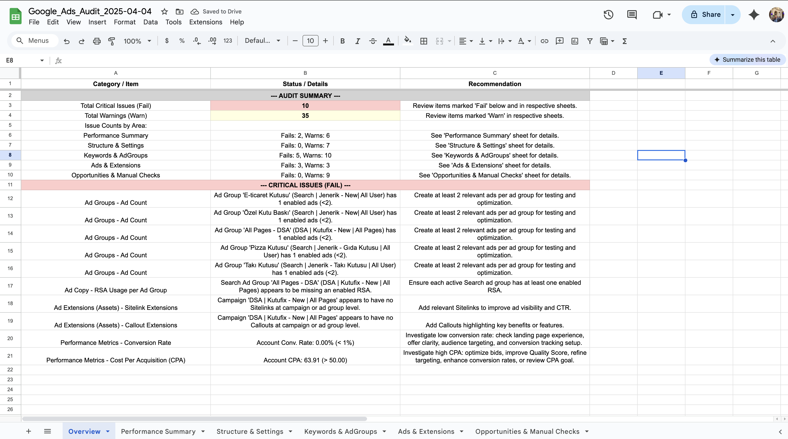

# Google Ads Account Audit Script

**Author:** Tugaycan Aslan
*   LinkedIn: [https://www.linkedin.com/in/tugaycanaslan/](https://www.linkedin.com/in/tugaycanaslan/)
*   X (Twitter): [https://x.com/tugaycanaslan](https://x.com/tugaycanaslan)

*(Generated & Modified with Cline)*

## Overview

This Google Ads Script performs a comprehensive, read-only audit of your Google Ads account. It checks against a predefined checklist covering various aspects like account structure, settings, keywords, ads, extensions, performance metrics, and more, based on common best practices.

The script aims to identify potential issues, areas for improvement, and adherence to best practices, saving you time on manual checks.

*(Example Spreadsheet Output)*

## Features

*   **Comprehensive Checklist**: Audits against a wide range of common Google Ads best practices.
*   **Configurable Thresholds**: Easily adjust performance thresholds (CTR, CPA, QS, etc.) in the `CONFIG` object at the top of the script.
*   **Detailed Logging**: Outputs detailed findings directly to the Google Ads Scripts Logger during execution.
*   **Dashboard Output**: Creates a Google Sheet named `Google_Ads_Audit_[YYYY-MM-DD]` with multiple tabs for organized results:
    *   **Overview Tab**: A high-level summary showing total critical issues (`Fail`) and warnings (`Warn`), counts per category, and a list of all critical `Fail` items. **Start your review here!**
    *   **Category Tabs** (e.g., `Performance Summary`, `Keywords & AdGroups`): Contain detailed findings for each specific audit area.
*   **Read-Only**: The script **does not make any changes** to your account configuration or bids. It only reads data for analysis.
*   **Error Handling**: Includes robust error handling to gracefully manage potential API limitations or errors, logging issues without stopping the entire script.
*   **Compatibility**: Uses standard `AdsApp` methods compatible with most Google Ads script environments.

## How to Use

1.  **Copy the Script**: Copy the entire content of the `audit.js` file.
2.  **Open Google Ads Scripts**: In your Google Ads account, navigate to `Tools & Settings` > `BULK ACTIONS` > `Scripts`.
3.  **Create New Script**: Click the `+` button to create a new script.
4.  **Paste Code**: Give the script a descriptive name (e.g., "Comprehensive Account Audit by Tugaycan") and paste the copied code into the editor, replacing any default content.
5.  **Configure Thresholds (Optional)**: Review and modify the values within the `CONFIG` object at the beginning of the script to match your specific account goals and standards.
6.  **Authorize**: Run the script once using the `Preview` button first. You will be prompted to authorize the script to access your Google Ads data and Google Drive/Sheets (for creating the spreadsheet). Review the permissions and grant authorization. Preview mode checks syntax and authorization without making live changes.
7.  **Run**: After successful preview and authorization, click `Run` to execute the full audit. The script may take several minutes to complete, especially for large accounts. Check the `Logs` for progress and detailed findings.
8.  **Review Results**:
    *   Check the `Logs` in the Google Ads Scripts interface for progress and any errors during execution.
    *   Open the Google Sheet created in your Google Drive (the name and URL will be logged).
    *   **Start with the `Overview` tab.** This provides the high-level summary and directs you to the most critical issues.
    *   Refer to the specific category tabs (e.g., `Performance Summary`, `Keywords & AdGroups`) for detailed findings related to the summaries or warnings on the `Overview` tab.
9.  **Schedule (Optional)**: For regular audits, set up a schedule (e.g., weekly or monthly) for the script to run automatically.

## Important Notes

*   **Execution Time**: Large accounts might approach the Google Ads Scripts execution time limit (typically 30 minutes). The script uses iterators and tries to be efficient, but very large accounts could still time out. If this happens, consider reducing the `LANDING_PAGE_SAMPLE_SIZE` in the config or running the script at the MCC level if applicable.
*   **API Limitations**: Some checklist items cannot be fully audited via the API (e.g., subjective ad copy quality, landing page speed testing, actual tag firing confirmation, detailed conversion action settings, user list availability, specific demographic targeting, competitor details beyond Auction Insights, automated rule logic, GA linking status). The script will log these as requiring manual review, often in the `Opportunities & Manual Checks` sheet. Recent API changes might also affect the availability of certain methods (like `getStats` or `isAutoTaggingEnabled`). This version works around known limitations but future Google updates might require adjustments.
*   **Permissions**: The script requires authorization to access Google Ads data and Google Drive/Sheets.
*   **Read-Only**: This script is designed to be safe and will **not** modify your account settings, bids, or status.
*   **Environment**: This script is designed to run within the Google Ads Scripts environment.

## Checklist Categories Covered (Mapped to Sheet Tabs)

*   **Overview**: Summary of critical issues (`Fail`) and warnings (`Warn`) across all categories.
*   **Performance Summary**: Account-level metrics (where available), Bidding Strategy checks, Campaign Optimization flags (manual review notes due to API limits).
*   **Structure & Settings**: Account Settings (IP Exclusions, Currency/Timezone, Manual check note for Auto-tagging), Account Structure checks (Campaign Naming, Budget Allocation).
*   **Keywords & AdGroups**: Keyword checks (Match Types, Negatives, QS, Duplicates, Manual check note for Performance), Ad Group checks (Keyword Count, Ad Count, Naming).
*   **Ads & Extensions**: Ad Copy checks (RSA Usage, Policy Status), Ad Extension checks (Sitelink/Callout coverage, other extension usage notes).
*   **Opportunities & Manual Checks**: Items requiring manual review in the UI (Conversion Tracking details, Landing Page specifics, Audience/Demographic details, Automation/Tools review, Competitive Analysis, Reporting setup) and general optimization suggestions.
